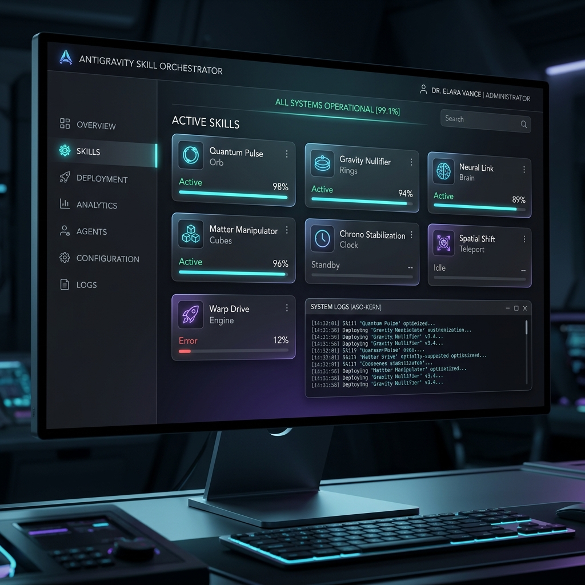
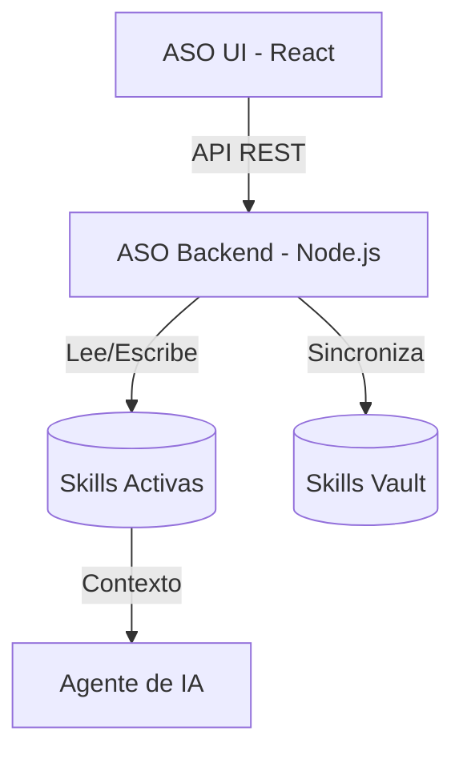

# 🤖 ASO — Antigravity Skill Orchestrator



[](https://github.com/alvaruskas/ASO-Antigravity-Skills-Orchestator)
[](https://github.com/alvaruskas/ASO-Antigravity-Skills-Orchestator)
[](https://github.com/alvaruskas/ASO-Antigravity-Skills-Orchestator)

> **"El agente no tiene amnesia si le enseñas a recordar."**  
> El sistema operativo definitivo para gestionar, organizar y activar las capacidades (skills) de tu agente de IA desde una interfaz visual de alta fidelidad.

---

## 🌌 ¿Qué es ASO?

**Antigravity Skill Orchestrator (ASO)** es la pieza central del ecosistema Antigravity. Es una aplicación local diseñada para eliminar la fragmentación de conocimientos en los agentes de IA. Actúa como un puente entre tus archivos de instrucciones (`SKILL.md`) y la ejecución en tiempo real.

Con ASO, dejas de preguntarte qué puede hacer tu agente y empiezas a orquestar su potencial.

### ✨ Características Principales
- 🖥️ **Dashboard Midnight Terminal**: Interfaz oscura con estética cian neón optimizada para largas sesiones de codificación.
- 🔌 **Toggle de Activación Instantánea**: Pasa skills de la Bóveda (Vault) al contexto activo del agente con un solo click.
- 📖 **Markdown High-Fidelity**: Visor integrado que renderiza tus directivas con total claridad.
- 🏷️ **Taxonomía Inteligente**: Filtrado dinámico por categorías (WordPress, IA, Diseño, Desarrollo, etc.).
- 🤖 **Skill Factory**: Generador asistido por IA para crear nuevas capacidades siguiendo el estándar Antigravity v4.x.

---

## 🏛️ Filosofía del Vault (La Bóveda)

> [!IMPORTANT]
> **La finalidad de ASO es evitar el colapso del contexto del agente.**

Tener cientos de skills activadas simultáneamente satura la "memoria de trabajo" de la IA, provocando alucinaciones, lentitud y pérdida de precisión. La **Bóveda (Vault)** permite almacenar miles de capacidades de forma latente. 

Solo activas lo que necesitas para la tarea actual, manteniendo al agente ágil, determinista y extremadamente eficiente. **Menos es más potencia.**

---

## 🏗️ Arquitectura del Sistema

ASO está construido para ser ligero, rápido y totalmente local.



---

## 🚀 Instalación Rápida

Sigue estos pasos para tener ASO funcionando en menos de 2 minutos:

### 1. Requisitos Previos
- **Node.js** v18 o superior.
- **npm** v9 o superior.

### 2. Clonar y Configurar
```bash
git clone https://github.com/alvaruskas/ASO-Antigravity-Skills-Orchestator.git
cd ASO-Antigravity-Skills-Orchestator
```

### 3. Instalación Automática
Hemos creado un script que se encarga de todo el trabajo sucio:
```bash
chmod +x setup.sh
./setup.sh
```

---

## ⚡ Cómo Usar ASO

Para arrancar el sistema completo (Backend + Frontend):
```bash
./start_aso.sh
```
La aplicación se abrirá automáticamente en `http://localhost:5174`.

### Comandos de Gestión
- **Actualizar Skills**: El sistema sincroniza automáticamente los cambios realizados en los archivos `.md`.
- **Cambiar Proyecto**: Puedes pasar la ruta de un proyecto específico al script de arranque:
  ```bash
  ./start_aso.sh /ruta/a/tu/otro/proyecto
  ```

---

## 🗂️ Taxonomía de Skills

| Categoría | Propósito |
| :--- | :--- |
| `🛠️ Metodología` | Flujos de trabajo, Git, Debugging y Calidad. |
| `⚡ WordPress` | Gestión de plugins, temas, performance y SEO. |
| `🎨 Diseño & UI` | Componentes premium, animaciones y UX. |
| `🤖 IA & Agentes` | Arquitectura de prompts y gestión de NotebookLM. |
| `🔄 Automatización` | Flujos de n8n, APIs de Meta y Webhooks. |

---

## 📚 Catálogo Completo de Skills

| Categoría | Skill | Descripción |
| :--- | :--- | :--- |
| `📦 Otros` | **agent-browser** | Navegación web asistida por agente. Permite al agente controlar el navegador para búsquedas, scraping y validación visual de páginas. |
| `📦 Otros` | **blueprint** | Úsalo al crear, editar o revisar archivos JSON de Blueprints de WordPress Playground. Se activa al mencionar blueprints, configuración de playground o solicitudes para configurar un entorno de demostración de WordPress. |
| `📦 Otros` | **font-to-web-converter** | Convierte fuentes locales (TTF/OTF) a formatos web optimizados (WOFF2) y genera automáticamente el CSS @font-face necesario. |
| `📦 Otros` | **pdf-manager** | Herramienta experta en la gestión técnica de documentos PDF. Permite unir, dividir y extraer información de archivos PDF de forma automatizada. |
| `📦 Otros` | **redsys-refund-manager** | Gestiona reembolsos parciales en WooCommerce (v3) de forma segura a través de la pasarela Redsys de José Conti, previniendo descuadres fiscales y manejando los errores específicos de la terminal bancaria. |
| `📦 Otros` | **skill-scanner** | Escanea los proyectos para detectar tecnologías y recomendar las skills más relevantes basadas en el contexto. |
| `📦 Otros` | **skill-validator** | Valida la estructura e integridad de un paquete de skill. |
| `📦 Otros` | **video-crossfade-generator** | Generador de transiciones crossfade (fundidos cruzados) avanzados para edición de vídeo automatizada e integración fluida. |
| `📦 Otros` | **video-reverser** | Herramienta de automatización para invertir y rebobinar clips de vídeo mediante procesamiento directo. |
| `📦 Otros` | **video-subtitler** | Genera subtítulos y leyendas para videos usando la IA de each::sense. Crea subtítulos autogenerados, leyendas multi-idioma, texto animado estilo TikTok, exportaciones SRT/VTT, diarización de hablantes y subtítulos incrustados. |
| `📦 Otros` | **wordpress-pages** | Creación y actualización de páginas informativas y legales en WordPress via REST API. |
| `🎨 Diseño & UI` | **experto-pixel-meta** | Especialista en la configuración y optimización del Píxel de Meta (Facebook Pixel) y Conversion API (CAPI) para eventos estándar y personalizados de eCommerce. |
| `🎨 Diseño & UI` | **premium-store-locator** | Diseño e implementación de contenedores web de alta gama basados en brutalismo arquitectónico, asimetría y tipografía premium. |
| `🎨 Diseño & UI` | **stitch-ui-design** | Especialista en diseño de interfaces y sistemas de diseño utilizando la herramienta Stitch. Crea componentes modernos, minimalistas y de alto impacto visual. |
| `🎨 Diseño & UI` | **ui-ux-pro-max** | Especialista en diseño de interfaces y experiencias de usuario de alta fidelidad. Domina tendencias como Bento Grids, Glassmorphism y tipografía moderna. |
| `🎨 Diseño & UI` | **web-animations-pro** | Especialista en animaciones web de alto nivel. Con experiencia en herramientas como GSAP, Framer Motion y Three.js, crea experiencias inmersivas con un enfoque en el rendimiento optimizado. |
| `⚡ WordPress` | **elementor-html-master** | Generador experto de código HTML/CSS/JS optimizado para el widget HTML de Elementor. Diseños premium, "shadow-free" y totalmente adaptables. |
| `⚡ WordPress` | **wordpress-local** | Gestión avanzada de entornos locales de WordPress utilizando WP-CLI y herramientas de automatización. |
| `⚡ WordPress` | **wordpress-performance-best-practices** | Guía de optimización de rendimiento WordPress para plugins, temas y código personalizado. Mejores prácticas de WP_Query, caché y REST API. |
| `⚡ WordPress` | **wordpress-pro** | Especialista en el ecosistema WordPress. Conocimiento avanzado de hooks, REST API y arquitectura de plugins/temas. |
| `⚡ WordPress` | **wordpress-router** | Úsalo cuando el usuario pregunte sobre bases de código de WordPress (plugins, temas, temas de bloques, bloques de Gutenberg, checkouts del núcleo de WP) y necesites clasificar rápidamente el repositorio y enrutar al flujo de trabajo/skill correcto (bloques, theme.json, API REST, WP-CLI, rendimiento, seguridad, pruebas, empaquetado de lanzamiento). |
| `⚡ WordPress` | **wp-abilities-api** | Use when working with the WordPress Abilities API (wp_register_ability, wp_register_ability_category, /wp-json/wp-abilities/v1/*, @wordpress/abilities) including defining abilities, categories, meta, REST exposure, and permissions checks for clients. |
| `⚡ WordPress` | **wp-admin-operator** | Operador experto del panel de administración de WordPress. Gestión visual de menús, plugins, temas y configuración general. |
| `⚡ WordPress` | **wp-auditor** | Auditoría técnica profunda de instalaciones de WordPress. Analiza seguridad, rendimiento y calidad del código. |
| `⚡ WordPress` | **wp-automation-designer** | Diseñador de flujos de trabajo y automatizaciones en WordPress. Integración de plugins de lógica y conectividad. |
| `⚡ WordPress` | **wp-block-development** | Use when developing or debugging custom WordPress blocks (Gutenberg): block.json, Edit/Save components, attributes, block supports, inner blocks, variations, and dynamic rendering. |
| `⚡ WordPress` | **wp-block-themes** | Use when working with WordPress Block Themes (Full Site Editing): theme.json configuration, templates, template parts, patterns, global styles, and block style variations. |
| `⚡ WordPress` | **wp-cwv-auditor** | Auditoría experta de Core Web Vitals para sitios WordPress. Identifica cuellos de botella en LCP, FID y CLS. |
| `⚡ WordPress` | **wp-hardening** | Especialista en seguridad activa y fortalecimiento de la seguridad de WordPress. Protección de archivos críticos mediante mecanismos de blindaje y configuración de permisos de acceso sólida. |
| `⚡ WordPress` | **wp-interactivity-api** | Use when building or debugging WordPress Interactivity API features (data-wp-* directives, @wordpress/interactivity store/state/actions, block viewScriptModule integration, wp_interactivity_*()) including performance, hydration, and directive behavior. |
| `⚡ WordPress` | **wp-migrator-pro** | Gestión avanzada de migraciones de WordPress, incluyendo base de datos, archivos y búsqueda/reemplazo de serialización. |
| `⚡ WordPress` | **wp-modernizer** | Refactorización y modernización de código legacy de WordPress hacia estándares modernos (PHP 8+, Namespace, OOP). |
| `⚡ WordPress` | **wp-performance** | Use when investigating or improving WordPress performance (backend-only agent): profiling and measurement (WP-CLI profile/doctor, Server-Timing, Query Monitor via REST headers), database/query optimization, autoloaded options, object caching, cron, HTTP API calls, and safe verification. |
| `⚡ WordPress` | **wp-phpstan** | Use when configuring, running, or fixing PHPStan static analysis in WordPress projects (plugins/themes/sites): phpstan.neon setup, baselines, WordPress-specific typing, and handling third-party plugin classes. |
| `⚡ WordPress` | **wp-playground** | Use when working with WordPress Playground (WASM): creating blueprints, configuring ephemeral sites, testing plugins/themes, and integrating Playground via CLI or browser. |
| `⚡ WordPress` | **wp-plugin-development** | Use when developing or debugging WordPress plugins: architecture, hooks (actions/filters), settings API, security best practices, data management, and plugin lifecycle. |
| `⚡ WordPress` | **wp-project-starter** | Inicia sesión en el sitio utilizando WP-CLI, activa plugins esenciales gratuitos como Yoast SEO, Wordfence Security y Jetpack, y personaliza la capa UX/UI configurando el tema, la barra de herramientas y ajustes de seguridad con pausas para datos sensibles. |
| `⚡ WordPress` | **wp-project-triage** | Use when first exploring or auditing a WordPress project (theme or plugin): structural analysis, tech stack detection, dependency mapping, and triage report generation. |
| `⚡ WordPress` | **wp-rest-api** | Use when working with the WordPress REST API: custom endpoints, routes, controllers, schema, authentication, discovery, and global parameters. |
| `⚡ WordPress` | **wp-wpcli-and-ops** | Use when performing operations on WordPress sites via WP-CLI: automation scripts, site management, search-replace, database operations, cron management, and multisite administration. |
| `⚡ WordPress` | **wpds** | Use when working with WordPress Design Systems (WPDS): implementation of standardized UI components, tokens, and layouts within the WordPress ecosystem. |
| `🔄 Automatización` | **meta-instagram-api** | Skill de Arquitectura Backend para la integración segura de cuentas de Instagram (vía Meta Graph API) en aplicaciones Next.js. Actívala cuando el usuario pida "Integrar perfil de Instagram", "conectar Meta API" o "montar backend para Meta Devs". |
| `🔄 Automatización` | **n8n-code-javascript** | Especialista en nodos de código de n8n usando JavaScript y manipulación avanzada del objeto $json. |
| `🔄 Automatización` | **n8n-code-python** | La descripción técnica se refiere a cómo escribir código en n8n con nodos de código y utiliza Python. |
| `🔄 Automatización` | **n8n-expression-syntax** | Valida la sintaxis del lenguaje de expresiones de n8n y corrige errores comunes. Utilizar cuando se escriben expresiones en n8n, utilizando el sintaxis {{}}, accediendo a variables $json/$node, depurando errores de expresión o trabajando con datos de webhooks en flujos de trabajo. |
| `🔄 Automatización` | **n8n-mcp-tools-expert** | Guía de experto para utilizar los herramientas MCP de n8n de manera efectiva. Utilice cuando esté buscando nodos, validando configuraciones, accediendo a plantillas, gestionando workflows o utilizando cualquier herramienta de MCP de n8n. Proporciona orientación sobre la selección de herramientas, formatos de parámetros y patrones comunes. |
| `🔄 Automatización` | **n8n-node-configuration** | Guía de configuración del nodo consciente de la operación. Utilizar cuando se configuran nodos, comprendiendo las dependencias de propiedad, determinando los campos requeridos, eligiendo entre niveles de detalle de get_node o aprendiendo patrones de configuración comunes por tipo de nodo. |
| `🔄 Automatización` | **n8n-validation-expert** | Interpreta errores de validación y guía la corrección de ellos. Utiliza cuando se encuentren con errores de validación, advertencias de validación, falsos positivos, problemas en la estructura de operadores o necesiten ayuda para entender los resultados de validación. También utiliza cuando pregunte sobre perfiles de validación, tipos de error o el proceso del bucle de validación. |
| `🔄 Automatización` | **n8n-workflow-patterns** | Patrones de arquitectura de flujo de trabajo basados en el entorno real de n8n. Utilizar cuando se está creando nuevos flujos de trabajo, diseñando la estructura del flujo de trabajo, eligiendo patrones de flujo de trabajo, planeando la arquitectura del flujo de trabajo o consultando sobre procesamiento de webhooks, integración de API HTTP, operaciones de base de datos, flujos de trabajo de agentes AI o tareas programadas. |
| `🖥️ Desarrollo Web` | **angular-expert** | Orientación exhaustiva para desarrollo en Angular v20+. Úsala para crear o refactorizar aplicaciones en Modern Angular. |
| `🖥️ Desarrollo Web` | **dotnet-backend** | Desarrollo backend con .NET 8+ (ASP.NET Core). Incluye EF Core, Minimal APIs y Autenticación JWT. |
| `🖥️ Desarrollo Web` | **nextjs-expert** | Guía completa para desarrollo con Next.js 15+ utilizando App Router, Server Components y patrones modernos de React. |
| `🖥️ Desarrollo Web` | **tauri-puertocabrera-expert** | Especialista en el Monolito Modular Tauri + Rust + React para la app "Consola IG Puerto Cabrera" (Local-First). Incluye las mejores prácticas para asincronía (tokio), seguridad y comunicación nativa. |
| `🛠️ Metodología` | **concise-planning** | Genera una lista de tareas atómica, clara y accionable antes de programar. Úsala para planificar nuevas funcionalidades. |
| `🛠️ Metodología` | **git-pushing** | Usa las etapas, los commit y las empujes de cambios Git utilizando mensajes de commite convencionales. Utiliza esto cuando el usuario desea hacer un commit y empujar los cambios o guardar su trabajo en un repositorio remoto. |
| `🛠️ Metodología` | **github-pro** | Automatización integral del flujo de trabajo en GitHub. Genera automáticamente PRs, gestiona ramas y mantiene el historial limpio. |
| `🛠️ Metodología` | **github-readme-expert** | Experto en creación de archivos README.md profesionales para repositorios. Estructura, redacta y optimiza documentación técnica de primer nivel. |
| `🛠️ Metodología` | **github-release-manager** | Orquestador experto de despliegues en GitHub. Aplica buenas prácticas de versionado semántico, changelogs y publicación de releases. |
| `🛠️ Metodología` | **kaizen** | Aplica la metodología de mejora continua al código y a los flujos de trabajo. Úsalo durante la implementación, refactorización o diseño. |
| `🛠️ Metodología` | **lint-and-validate** | Ejecuta procedimientos de control de calidad, linting y análisis estático. Úsala para asegurar que el código cumple los estándares. |
| `🛠️ Metodología` | **systematic-debugging** | Implementa un proceso de análisis de causa raíz en 4 fases. Úsalo ante cualquier bug, fallo de test o comportamiento inesperado. |
| `🤖 IA & Agentes` | **autonomous-skill-hunter** | Meta-skill que busca de forma óptima en el ecosistema nuevas skills, las adapta al flujo de trabajo del usuario, las almacena en un directorio Vault centralizado y prepara la activación global o por proyecto. Actívala cuando el usuario pida "buscar una skill", "necesito una capacidad nueva" o "adapta una skill para este proyecto". |
| `🤖 IA & Agentes` | **find-skills** | Ayuda a descubrir e instalar skills del agente cuando el usuario pregunta '¿cómo hago X?', 'busca una skill para X' o quiere extender capacidades. |
| `🤖 IA & Agentes` | **notebooklm-autonomous-researcher** | Crea un cuaderno en NotebookLM sobre un tema, realiza búsquedas adaptativas (fast o deep research), cura las fuentes eliminando las irrelevantes, rellena vacíos de información mediante nuevas búsquedas y genera un resumen que se guarda como nota. Actívala cuando el usuario pida "crear un cuaderno sobre [tema]", "investiga [tema] y haz un cuaderno" o "hazme un resumen de [tema] con fuentes". |
| `🤖 IA & Agentes` | **notebooklm-expert** | Guía completa para usar el servidor MCP de Google NotebookLM. Úsala para gestionar cuadernos, fuentes, notas y artefactos de estudio vía agente. |
| `🤖 IA & Agentes` | **notebooklm-operator** | Especialista en la operación avanzada de NotebookLM vía MCP. Permite gestionar cuadernos, fuentes y generar contenido dinámico para el ecosistema Antigravity. |
| `🤖 IA & Agentes` | **notebooklm-senior-architect** | Habilidad híbrida (Estrategia + MCP). Define metodología experta (PPVS, RTR) para buscar, estructurar fuentes y ejecutar consultas avanzadas en NotebookLM evitando alucinaciones, sumando protocolos de ejecución M2M automatizada. |
| `🤖 IA & Agentes` | **notebooklm-skill-architect** | Crea y diseña nuevas skills (SKILL.md) centradas en el uso de NotebookLM. Actívala cuando se solicite desarrollar un flujo de trabajo que implique la búsqueda e ingesta de fuentes, redacción de prompts avanzados (consultas), uso de investigación adaptativa (fast/deep research) y guardado de notas automáticas en cuadernos. |
| `🤖 IA & Agentes` | **notebooklm-sync** | Sincroniza las definiciones locales de skills con un cuaderno NotebookLM para mantener la documentación actualizada de forma automática. |
| `🤖 IA & Agentes` | **skill-creator** | Usa esta skill para crear nuevas skills o actualizar las existentes siguiendo el estándar Antigravity v4.x. |
| `🤖 IA & Agentes` | **skill-dashboard** | Interfaz visual (ASO) para la gestión y orquestación de habilidades del agente. Activa, desactiva y supervisa el ecosistema de skills en tiempo real. |
| `🤖 IA & Agentes` | **skill-recommender** | Sugiere las skills más apropiadas para un proyecto basándose en el análisis estructural y necesidades detectadas. |

---

## 🛠️ Desarrollo e Integración

Si deseas extender las capacidades de ASO o integrar tu propio servidor MCP:
1. Revisa la carpeta `aso-app-codigo-fuente/backend/server.js` para ver los endpoints de la API.
2. Las skills se almacenan en `skills-library/vault/` por defecto.

---

## 💎 Créditos

- **Concepto y Dirección**: Álvaro Crespo (Responsable Creativo UX/UI en BcBiocon Internacional).
- **Desarrollo**: Antigravity AI Agent.
- **Estética**: Midnight Terminal Design System.

---

© 2026 — **BCBiocon Internacional**  
*Impulsando la inteligencia artificial determinista y confiable.*
