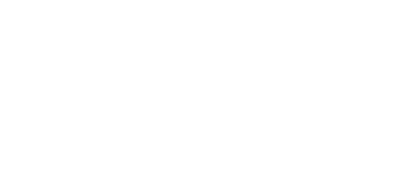

# ASO (Antigravity Skill Orchestrator)


<p align="center">
  
</p>

ASO es un entorno gráfico y orquestador local para el ecosistema **Antigravity**. Desarrollado con una arquitectura moderna que separa el backend (procesamiento de FileSystem y API REST con Express/Ollama) y un frontend web visual y reactivo (React + Vite).

Su función principal es orquestar, activar, desactivar y administrar *skills* (agentes autónomos) dotando al usuario del control de qué herramientas están disponibles a nivel **Global** o a nivel de **Proyecto** (*Human-in-the-Loop*).

## Arquitectura

El ecosistema se divide en dos módulos principales:
- **`backend/`**: Servidor Node.js + Express en el puerto 4000. Gestiona la bóveda (`skills_vault`), interactúa con el FileSystem moviendo físicamente las carpetas de las skills según el contexto, y levanta un túnel de conexión a Ollama (llama3.1) para la redacción de *frontmatters* YAML y consultas básicas.
- **`frontend/`**: Aplicación web construida con React, Vite y Chakra UI corriendo en el puerto 5174. 

## Requisitos Previos

- **Node.js** (v18 o superior).
- **Ollama** ejecutándose localmente con el modelo `llama3.1` nativo o descargado.

## Instalación y Ejecución

La forma recomendada de arrancar el orquestador por completo es utilizando el script nativo de inicialización incluido en la raíz del proyecto.

```bash
# Otorgar permisos de ejecución al script si es necesario
chmod +x start_aso.sh

# Arrancar los servidores (Backend y Frontend simultáneamente)
./start_aso.sh
```

El script buscará automáticamente dependencias de los módulos (ejecutando `npm i` donde proceda), arrancará el puerto 4000 de forma silenciosa para el backend, y abrirá en tu navegador por defecto el panel visual web del orquestador en `http://localhost:5174`.

## Estructura de Skills y Metodología (Vault)

*Antigravity* emula un sistema multi-agente donde las skills son definiciones estrictas dictadas en lenguaje de marcado (Archivos `SKILL.md`).
A través de la interfaz de ASO, los usuarios pueden:
- **Ver Skills Globales:** Repositorio activo universal disponible para cualquier operación.
- **Skills del Proyecto:** Instancias locales inyectadas en la raíz actual apuntando al entorno de trabajo (usando `.aso_profile.json`).
- **Bóveda (Vault):** El almacén (`~/.gemini/antigravity/skills_vault`) que contiene skills inactivas, evitando saturar el contexto de los modelos con herramientas no utilizadas.
